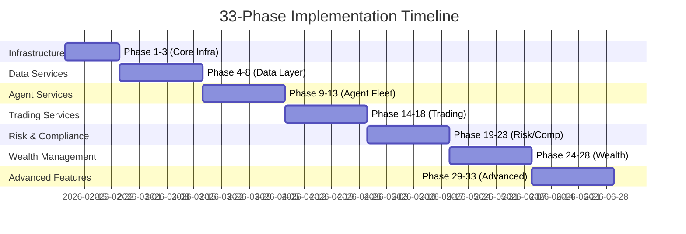

# 🛰️ Sovereign OS: 33-Phase Roadmap for Services-to-Frontend Integration

> **Document Version**: 1.0  
> **Created**: 2026-02-08  
> **Purpose**: Map all 133 backend services to frontend Pages, Widgets, and Modals to ensure 100% UI coverage.

---

## Executive Summary

This roadmap defines a **33-phase implementation plan** to ensure every backend service in the Sovereign OS has a corresponding frontend interface. After auditing 133 backend services and 117 existing frontend pages across 18 departments, this document identifies gaps and creates a phased approach to achieve full front-to-back integration.

### Audit Results
| Category | Count |
|----------|-------|
| Total Backend Services | 133 |
| Existing Frontend Pages | ~117 |
| Services with Full Frontend Coverage | ~85 |
| Services Requiring New Interfaces | ~48 |

---

## Frontend Interface Types

| Type | Description | Example |
|------|-------------|---------|
| **PAGE** | Full-screen dedicated interface with multiple widgets | `/trader/monitor` |
| **WIDGET** | Reusable component embedded in pages/dashboards | `OrderbookDepthWidget` |
| **MODAL** | Pop-up dialog for quick actions or confirmations | `AddWatchlistModal` |
| **PANEL** | Sliding side-panel for context-aware information | `PositionDetailsPanel` |

---

## Phase Overview

---

## 🔧 PHASES 1-3: INFRASTRUCTURE & SYSTEM CORE

### Phase 1: Infrastructure Monitoring Dashboard
**Services Covered**: `infrastructure`, `kafka`, `neo4j`, `caching`, `logging`, `system`

| Component | Type | Route | Backend Service | Description |
|-----------|------|-------|-----------------|-------------|
| Event Bus Monitor | PAGE | `/admin/event-bus` | `infrastructure.event_bus` | Real-time pub/sub message flow visualization |
| Cache Analytics | WIDGET | (Mission Control) | `infrastructure.cache_service` | Hit/miss ratios, memory usage, cache invalidation controls |
| Kafka Consumer Health | WIDGET | (Mission Control) | `kafka.consumer` | Consumer lag, partition offsets, throughput metrics |
| Private Cloud Storage | PAGE | `/admin/storage` | `infrastructure.private_cloud` | ZFS pool status, quota management, sync status |
| Neo4j Explorer | PAGE | `/admin/graph-browser` | `neo4j.graph_manager` | Visual node/edge browser with query console |
| System Logs Viewer | PAGE | `/admin/logs` | `logging.log_service` | Searchable log aggregation with filters |

**Acceptance Criteria**:
- [ ] Event Bus Monitor shows message throughput per topic with 5s refresh
- [ ] Cache Analytics displays 24h hit/miss trend charts
- [ ] Kafka Consumer Health shows all consumer groups with lag warnings
- [ ] Neo4j Explorer supports Cypher query execution with visual results

---

### Phase 2: Monitoring & Observability Suite
**Services Covered**: `monitoring`, `streaming`, `middleware`

| Component | Type | Route | Backend Service | Description |
|-----------|------|-------|-----------------|-------------|
| Service Health Grid | PAGE | `/admin/health` | `monitoring.health_check` | All-services status grid with uptime history |
| Latency Heatmap | WIDGET | (Mission Control) | `monitoring.latency_tracker` | P50/P95/P99 latencies across all endpoints |
| WebSocket Status | WIDGET | (Mission Control) | `streaming.websocket_manager` | Active connections, message rates, errors |
| Middleware Pipeline | PAGE | `/admin/middleware` | `middleware.pipeline` | Request/response interceptor chain visualization |
| Alert Configuration | PAGE | `/admin/alerts-config` | `monitoring.alert_rules` | Configure thresholds for system alerts |

**Acceptance Criteria**:
- [ ] Service Health Grid auto-refreshes every 10s with color-coded status
- [ ] Latency Heatmap shows drill-down to individual endpoint histograms
- [ ] Alert rules can be created/edited via form with preview

---

### Phase 3: Blue-Green Deployment & Operations
**Services Covered**: `blue_green`, `operations`, `workspace`

| Component | Type | Route | Backend Service | Description |
|-----------|------|-------|-----------------|-------------|
| Deployment Controller | PAGE | `/admin/deployments` | `blue_green.controller` | Blue/Green environment switcher with rollback |
| Operations Dashboard | PAGE | `/admin/ops` | `operations.ops_manager` | Scheduled jobs, cron tasks, batch processes |
| Workspace Manager | PAGE | `/admin/workspaces` | `workspace.manager` | Multi-tenant workspace isolation UI |
| Environment Variables | MODAL | (Admin Settings) | `system.env_manager` | Runtime environment config viewer |
| Feature Flags | PAGE | `/admin/features` | `operations.feature_flags` | Toggle experimental features per user/role |

**Acceptance Criteria**:
- [ ] Deployment Controller shows traffic percentages during canary rollouts
- [ ] Operations Dashboard displays cron job history with success/failure logs
- [ ] Feature Flags support A/B testing with user percentage targeting

---

## 📊 PHASES 4-8: DATA & MARKET INTELLIGENCE

### Phase 4: Market Data Foundation
**Services Covered**: `market_data`, `market`, `data`, `indicators`

| Component | Type | Route | Backend Service | Description |
|-----------|------|-------|-----------------|-------------|
| Forced Seller Monitor | PAGE | `/data-scientist/forced-sellers` | `market_data.forced_seller_svc` | Passive ownership fragility analysis |
| Whale Flow Terminal | PAGE | `/data-scientist/whale-flow` | `market_data.fund_flow_service` | 13F filing delta visualization |
| Volume Promo Detector | WIDGET | (Market Intelligence) | `market_data.volume_monitor` | Social-media-driven pump alerts |
| Technical Indicators | PAGE | `/data-scientist/indicators` | `indicators.indicator_engine` | Full indicator library with parameter tuning |
| Market Regime Classifier | WIDGET | (Strategist Dashboard) | `market.regime_classifier` | Bull/Bear/Choppy regime detection |

**Acceptance Criteria**:
- [ ] Forced Seller Monitor shows passive concentration heatmap by sector
- [ ] Whale Flow Terminal displays 13F filing timeline with position changes
- [ ] Technical Indicators support custom indicator combinations

---

### Phase 5: Data Ingestion & Integration
**Services Covered**: `ingestion`, `integration`, `integrations`, `external`

| Component | Type | Route | Backend Service | Description |
|-----------|------|-------|-----------------|-------------|
| Data Pipeline Manager | PAGE | `/admin/pipelines` | `ingestion.pipeline_manager` | ETL job orchestration with status |
| API Connector Hub | PAGE | `/admin/connectors` | `integrations.connector_registry` | Third-party API connection manager |
| External Data Sources | PAGE | `/data-scientist/sources` | `external.data_sources` | Alpha Vantage, Finnhub, Polygon configuration |
| Webhook Receiver | PAGE | `/admin/webhooks` | `integration.webhook_handler` | Inbound webhook configuration |
| Data Quality Monitor | WIDGET | (Data Pipeline Manager) | `ingestion.quality_checker` | Schema validation, null rate, freshness |

**Acceptance Criteria**:
- [ ] Data Pipeline Manager shows DAG visualization of ETL dependencies
- [ ] API Connector Hub supports OAuth2 and API key authentication flows
- [ ] Data Quality Monitor generates automated data quality reports

---

### Phase 6: News & Sentiment Intelligence
**Services Covered**: `news`, `social`, `social_trading`

| Component | Type | Route | Backend Service | Description |
|-----------|------|-------|-----------------|-------------|
| News Aggregator | PAGE | `/hunter/news` | `news.aggregator` | Multi-source financial news with NLP tagging |
| Social Sentiment Radar | PAGE | `/data-scientist/social-sentiment` | `social.sentiment_analyzer` | Twitter/Reddit/StockTwits sentiment scores |
| Social Trading Feed | PAGE | `/hunter/social-trading` | `social_trading.feed` | Copy-trading and influencer position tracking |
| Trend Detection | WIDGET | (Hunter Dashboard) | `social.trend_detector` | Emerging topic identification |
| Rumor Mill | PAGE | `/hunter/rumors-detail` | `news.rumor_classifier` | FDA/Earnings rumor verification status |

**Acceptance Criteria**:
- [ ] News Aggregator supports keyword-based custom news streams
- [ ] Social Sentiment shows historical sentiment vs price correlation
- [ ] Trend Detection identifies trending tickers before price moves

---

### Phase 7: Research & Analytics Platform
**Services Covered**: `research`, `analysis`, `analytics`, `quantitative`

| Component | Type | Route | Backend Service | Description |
|-----------|------|-------|-----------------|-------------|
| Research Workspace | PAGE | `/data-scientist/research-workspace` | `research.workspace` | Jupyter-like notebook for financial research |
| Factor Analysis Suite | PAGE | `/data-scientist/factors` | `quantitative.factor_engine` | Fama-French, Momentum, Quality factor decomposition |
| Fundamental Scanner | PAGE | `/data-scientist/fundamentals` | `analysis.fundamental_scanner` | P/E, PEG, DCF screening tools |
| Sector Rotation Model | WIDGET | (Strategist Dashboard) | `analytics.sector_rotation` | Sector momentum with timing signals |
| Quant Backtest Lab | PAGE | `/data-scientist/quant-backtest` | `quantitative.backtest_engine` | Monte Carlo simulation for strategy validation |

**Acceptance Criteria**:
- [ ] Research Workspace supports Python code execution in sandboxed environment
- [ ] Factor Analysis shows factor exposure heatmaps for portfolios
- [ ] Quant Backtest Lab generates Sharpe, Sortino, Max Drawdown metrics

---

### Phase 8: Charting & Visualization
**Services Covered**: `charting`, `pricing`

| Component | Type | Route | Backend Service | Description |
|-----------|------|-------|-----------------|-------------|
| Advanced Chart Builder | PAGE | `/trader/chart-builder` | `charting.chart_engine` | TradingView-style charting with custom studies |
| Multi-Timeframe Analysis | WIDGET | (Trading Terminal) | `charting.mtf_analyzer` | Synchronized multi-timeframe chart grid |
| Options Probability Cone | WIDGET | (Physicist Dashboard) | `pricing.probability_cone` | Expected move visualization |
| Heat Map Generator | PAGE | `/data-scientist/heatmaps` | `charting.heatmap_generator` | Correlation, sector, factor heatmaps |
| Export & Sharing | MODAL | (Chart Builder) | `charting.export_service` | PNG/PDF export with watermarking |

**Acceptance Criteria**:
- [ ] Advanced Chart Builder supports 50+ indicators and drawing tools
- [ ] Multi-Timeframe shows 1D/4H/1H synchronized charts
- [ ] Options Probability Cone calculates from real IV data

---

## 🤖 PHASES 9-13: AGENT WORKFORCE MANAGEMENT

### Phase 9: Agent Fleet Command Center
**Services Covered**: `agents`, `coordination`

| Component | Type | Route | Backend Service | Description |
|-----------|------|-------|-----------------|-------------|
| Agent Fleet Overview | PAGE | `/orchestrator/agents` | `agents.fleet_manager` | All 84 agents status grid with role indicators |
| Heartbeat Monitor | WIDGET | (Fleet Overview) | `agents.heartbeat_service` | Real-time alive/dead status per agent |
| Rogue Agent Detector | WIDGET | (Fleet Overview) | `agents.rogue_killer` | TPM thresholds and kill history |
| Agent Task Queue | PAGE | `/orchestrator/agent-tasks` | `coordination.task_queue` | Pending/running/completed agent tasks |
| Agent Logs Viewer | PANEL | (Fleet Overview) | `agents.log_service` | Per-agent execution logs with filters |

**Acceptance Criteria**:
- [ ] Agent Fleet Overview shows all 84 agents organized by department
- [ ] Heartbeat Monitor triggers visual alerts for dead agents within 10s
- [ ] Rogue Agent Detector shows kill history with root cause analysis

---

### Phase 10: AI Debate & Consensus System
**Services Covered**: `debate` (partially covered), `agents.debate_orchestrator`, `agents.consensus_engine`

| Component | Type | Route | Backend Service | Description |
|-----------|------|-------|-----------------|-------------|
| Debate Arena | PAGE | `/orchestrator/debate-arena` | `agents.debate_orchestrator` | Live Bull vs Bear debate visualization |
| Consensus Voting Panel | WIDGET | (Debate Arena) | `agents.consensus_engine` | Agent vote tallies with approval percentage |
| Debate History Browser | PAGE | `/orchestrator/debate-history` | `debate.history_service` | Past debate transcripts with outcomes |
| Human Intervention | MODAL | (Debate Arena) | `debate.human_input` | User argument injection interface |
| Verdict Tracker | WIDGET | (Debate Arena) | `debate.verdict_tracker` | Real-time sentiment score evolution |

**Acceptance Criteria**:
- [ ] Debate Arena shows turn-by-turn debate with confidence scores
- [ ] Consensus Voting displays vote breakdown by persona type
- [ ] Human Intervention allows users to influence live debates

---

### Phase 11: AI Model & Memory Management
**Services Covered**: `ai`, `ai_assistant`, `ai_predictions`, `memory_service`, `ml`

| Component | Type | Route | Backend Service | Description |
|-----------|------|-------|-----------------|-------------|
| Model Registry | PAGE | `/refiner/models` | `ai.model_registry` | LLM, ML model versions and endpoints |
| Prediction Dashboard | PAGE | `/data-scientist/ai-predictions` | `ai_predictions.prediction_service` | ML price/volatility predictions |
| AI Memory Graph | PAGE | `/refiner/memory` | `memory_service.memory_manager` | Agent long-term memory visualization |
| AI Assistant Configuration | PAGE | `/orchestrator/ai-config` | `ai_assistant.config_manager` | Assistant behavior and prompt tuning |
| ML Model Training | PAGE | `/refiner/training` | `ml.training_pipeline` | Model retraining jobs with metrics |

**Acceptance Criteria**:
- [ ] Model Registry shows model lineage and deployment history
- [ ] Prediction Dashboard displays prediction accuracy tracking
- [ ] AI Memory Graph visualizes agent memory as knowledge graph

---

### Phase 12: Mission & Mode Control
**Services Covered**: `mission_service`, `modes`

| Component | Type | Route | Backend Service | Description |
|-----------|------|-------|-----------------|-------------|
| Mission Planner | PAGE | `/orchestrator/missions` | `mission_service.mission_manager` | Long-term financial mission definition |
| Mode Switcher | WIDGET | (Global Header) | `modes.mode_controller` | Defense/Attack/Stealth mode toggle |
| Mission Progress Tracker | PAGE | `/architect/mission-progress` | `mission_service.progress_tracker` | Goal completion vs timeline visualization |
| Mode-Aware Alerts | WIDGET | (Notification Center) | `modes.alert_filter` | Alerts filtered by current mode |
| Autopilot Configuration | PAGE | `/orchestrator/autopilot` | `mission_service.autopilot` | Automated action rules per mode |

**Acceptance Criteria**:
- [ ] Mission Planner supports multi-year goal hierarchies
- [ ] Mode Switcher shows UI theme changes per mode
- [ ] Autopilot Configuration supports conditional logic chains

---

### Phase 13: Meta-Optimization & Evolution
**Services Covered**: `meta_optimizer`, `evolution`, `singularity`

| Component | Type | Route | Backend Service | Description |
|-----------|------|-------|-----------------|-------------|
| Meta-Optimizer Dashboard | PAGE | `/refiner/meta-optimizer` | `meta_optimizer.optimizer` | Agent performance evolution tracking |
| Strategy Evolution Lab | PAGE | `/refiner/evolution` | `evolution.genetic_optimizer` | Genetic algorithm strategy optimization |
| Singularity Monitor | PAGE | `/refiner/singularity` | `singularity.threshold_monitor` | AI capability trajectory tracking |
| Prompt A/B Tester | PAGE | `/refiner/prompt-ab` | `meta_optimizer.prompt_tester` | Prompt variant performance comparison |
| Agent DNA Viewer | WIDGET | (Meta-Optimizer) | `evolution.dna_viewer` | Strategy gene visualization |

**Acceptance Criteria**:
- [ ] Meta-Optimizer shows agent performance trends over time
- [ ] Strategy Evolution Lab displays generation-by-generation fitness
- [ ] Prompt A/B Tester supports statistical significance testing

---

## 📈 PHASES 14-18: TRADING & EXECUTION

### Phase 14: Order Execution Enhancement
**Services Covered**: `execution`, `trading`

| Component | Type | Route | Backend Service | Description |
|-----------|------|-------|-----------------|-------------|
| Order Management System | PAGE | `/trader/oms` | `execution.order_manager` | Order lifecycle tracking (queued→filled) |
| Smart Order Router | PAGE | `/trader/smart-routing` | `execution.smart_router` | Multi-venue routing optimization |
| Execution Analytics | PAGE | `/auditor/execution-analytics` | `trading.execution_analytics` | Fill quality, slippage analysis |
| Order Preview Modal | MODAL | (Trading Terminal) | `execution.order_preview` | Full cost breakdown before submission |
| Order Modification | MODAL | (Trading Terminal) | `execution.order_modifier` | In-flight order amendment interface |

**Acceptance Criteria**:
- [ ] Order Management System shows order state machine visualization
- [ ] Smart Order Router displays venue-by-venue fill rate comparison
- [ ] Execution Analytics calculates implementation shortfall

---

### Phase 15: Options Trading Suite
**Services Covered**: `options` (expanding existing `/trader/options`)

| Component | Type | Route | Backend Service | Description |
|-----------|------|-------|-----------------|-------------|
| Greeks Surface | PAGE | `/physicist/greeks-surface` | `options.greeks_calculator` | 3D Delta/Gamma/Vega surface plots |
| Position Greeks Analyzer | WIDGET | (Physicist Dashboard) | `options.position_greeks` | Portfolio-level Greeks aggregation |
| P&L Scenario Modeler | PAGE | `/physicist/scenario-modeler` | `options.scenario_modeler` | What-if P&L for price/vol/time changes |
| IV Rank/Percentile | WIDGET | (Options Chain) | `options.iv_analyzer` | Historical IV context for each strike |
| Options Flow Scanner | PAGE | `/hunter/options-flow` | `options.flow_scanner` | Unusual options activity detection |

**Acceptance Criteria**:
- [ ] Greeks Surface supports rotation and zoom for 3D exploration
- [ ] Position Greeks shows net Greeks for multi-leg strategies
- [ ] Options Flow Scanner flags sweeps and block trades

---

### Phase 16: Broker Integration Hub
**Services Covered**: `broker`, `brokerage`, `brokers`

| Component | Type | Route | Backend Service | Description |
|-----------|------|-------|-----------------|-------------|
| Broker Connection Manager | PAGE | `/admin/brokers` | `brokerage.connection_manager` | Multi-broker OAuth connection UI |
| Account Aggregator | PAGE | `/guardian/accounts` | `brokers.account_aggregator` | Cross-broker account summary |
| Broker Health Monitor | WIDGET | (Mission Control) | `broker.health_monitor` | API status per broker |
| Transaction Sync | PAGE | `/admin/transaction-sync` | `brokerage.sync_service` | Manual/auto transaction import |
| Broker Comparison | PAGE | `/envoy/broker-compare` | `brokerage.comparison_engine` | Fee/feature comparison matrix |

**Acceptance Criteria**:
- [ ] Broker Connection Manager supports major brokers (IBKR, Schwab, Robinhood)
- [ ] Account Aggregator shows unified position view across brokers
- [ ] Transaction Sync supports manual CSV import fallback

---

### Phase 17: Backtest & Strategy Validation
**Services Covered**: `backtest`, `simulation`, `strategies`, `strategy`

| Component | Type | Route | Backend Service | Description |
|-----------|------|-------|-----------------|-------------|
| Backtest Engine | PAGE | `/data-scientist/backtest-engine` | `backtest.engine` | Full historical strategy replay |
| Walk-Forward Analyzer | PAGE | `/strategist/walk-forward` | `backtest.walk_forward` | Rolling window validation |
| Strategy Performance Report | PAGE | `/auditor/strategy-report` | `strategies.performance_reporter` | Comprehensive strategy metrics |
| Monte Carlo Simulator | WIDGET | (Backtest Engine) | `simulation.monte_carlo` | 1000-path future projections |
| Strategy Template Library | PAGE | `/strategist/templates` | `strategy.template_library` | Pre-built strategy blueprints |

**Acceptance Criteria**:
- [ ] Backtest Engine supports tick/bar/daily granularity
- [ ] Walk-Forward Analyzer shows IS vs OOS performance split
- [ ] Monte Carlo Simulator generates VaR/CVaR confidence bands

---

### Phase 18: Watchlist & Opportunity Management
**Services Covered**: `watchlist`

| Component | Type | Route | Backend Service | Description |
|-----------|------|-------|-----------------|-------------|
| Enhanced Watchlist Manager | PAGE | `/trader/watchlists` | `watchlist.manager` | Multi-list organization with tags |
| Price Alert Center | PAGE | `/trader/price-alerts` | `watchlist.alert_service` | Cross-asset price/indicator alerts |
| Opportunity Tracker | PAGE | `/strategist/opportunities` | `watchlist.opportunity_tracker` | Thesis-based opportunity journal |
| Screener Builder | PAGE | `/data-scientist/screener-builder` | `watchlist.screener_engine` | Custom multi-criteria screeners |
| Watchlist Sharing | MODAL | (Watchlist Manager) | `watchlist.share_service` | Share watchlists with team/advisors |

**Acceptance Criteria**:
- [ ] Enhanced Watchlist Manager supports 100+ symbols per list
- [ ] Price Alert Center supports complex alert conditions
- [ ] Screener Builder saves and schedules recurring screens

---

## 🛡️ PHASES 19-23: RISK, COMPLIANCE & SECURITY

### Phase 19: Risk Management Console
**Services Covered**: `risk`, `fraud`

| Component | Type | Route | Backend Service | Description |
|-----------|------|-------|-----------------|-------------|
| Risk Dashboard | PAGE | `/strategist/risk-dashboard` | `risk.risk_aggregator` | Portfolio-wide VaR, stress metrics |
| Position Sizing Calculator | WIDGET | (Trading Terminal) | `risk.position_sizer` | Kelly criterion, fixed-fraction sizing |
| Correlation Risk Monitor | PAGE | `/strategist/correlation-risk` | `risk.correlation_monitor` | Correlation breakdown during stress |
| Fraud Detection Center | PAGE | `/guardian/fraud-center` | `fraud.detection_engine` | Suspicious activity flagging |
| Risk Limit Manager | PAGE | `/strategist/risk-limits` | `risk.limit_manager` | Daily loss, position size limits |

**Acceptance Criteria**:
- [ ] Risk Dashboard calculates 95% VaR with historical simulation
- [ ] Position Sizing shows optimal size given risk parameters
- [ ] Fraud Detection flags anomalous transactions in real-time

---

### Phase 20: Compliance & Regulatory Suite
**Services Covered**: `compliance`, `legal`

| Component | Type | Route | Backend Service | Description |
|-----------|------|-------|-----------------|-------------|
| Compliance Tracker | PAGE | `/lawyer/compliance-tracker` | `compliance.rule_engine` | Regulation checklist with status |
| Trade Surveillance | PAGE | `/lawyer/surveillance` | `compliance.trade_surveillance` | Pattern-based suspicious trade detection |
| Regulatory Filing Manager | PAGE | `/lawyer/filings` | `legal.filing_manager` | 13F, Schedule 13D filing preparation |
| Legal Document Generator | PAGE | `/lawyer/doc-generator` | `legal.document_generator` | NDA, partnership agreement templates |
| Audit Trail Exporter | MODAL | (Compliance Tracker) | `compliance.audit_exporter` | SEC-ready audit log export |

**Acceptance Criteria**:
- [ ] Compliance Tracker shows regulation-by-regulation status
- [ ] Trade Surveillance detects wash trading, front-running patterns
- [ ] Regulatory Filing Manager generates EDGAR-compatible files

---

### Phase 21: Security & Authentication
**Services Covered**: `security`, `auth`, `warden`

| Component | Type | Route | Backend Service | Description |
|-----------|------|-------|-----------------|-------------|
| Security Center | PAGE | `/sentry/security-center` | `security.security_manager` | Unified security posture view |
| Session Manager | PAGE | `/sentry/sessions` | `auth.session_manager` | Active sessions with kill capability |
| Warden Control Panel | PAGE | `/sentry/warden` | `warden.threat_detector` | Real-time threat detection dashboard |
| API Key Manager | PAGE | `/sentry/api-keys` | `auth.api_key_service` | Personal API token management |
| Audit Log Viewer | PAGE | `/sentry/security-logs` | `security.audit_logger` | Security event timeline |

**Acceptance Criteria**:
- [ ] Security Center shows overall security score with recommendations
- [ ] Session Manager allows remote session termination
- [ ] Warden Control Panel displays threat severity classifications

---

### Phase 22: Audit & Reconciliation
**Services Covered**: `audit`, `reconciliation`

| Component | Type | Route | Backend Service | Description |
|-----------|------|-------|-----------------|-------------|
| Audit Command Center | PAGE | `/auditor/command-center` | `audit.audit_manager` | Scheduled audit job management |
| Transaction Reconciler | PAGE | `/auditor/reconciliation` | `reconciliation.reconciler` | Bank vs internal record matching |
| Discrepancy Resolver | PAGE | `/auditor/discrepancies` | `reconciliation.discrepancy_resolver` | Manual discrepancy resolution workflow |
| Audit Report Generator | PAGE | `/auditor/reports` | `audit.report_generator` | Automated audit report creation |
| Data Integrity Scanner | WIDGET | (Audit Command Center) | `reconciliation.integrity_scanner` | Graph vs database consistency checks |

**Acceptance Criteria**:
- [ ] Transaction Reconciler shows match/unmatch status per account
- [ ] Discrepancy Resolver supports approval workflow with comments
- [ ] Data Integrity Scanner runs daily with Slack notifications

---

### Phase 23: Validation & Quality Control
**Services Covered**: `validators`, `valuation`, `reputation`

| Component | Type | Route | Backend Service | Description |
|-----------|------|-------|-----------------|-------------|
| Validation Rule Builder | PAGE | `/admin/validation-rules` | `validators.rule_builder` | Custom data validation rules |
| Valuation Engine | PAGE | `/auditor/valuation` | `valuation.valuation_engine` | Multi-method asset valuation (DCF, Comps) |
| Data Quality Dashboard | PAGE | `/admin/data-quality` | `validators.quality_dashboard` | System-wide data quality metrics |
| Reputation Tracker | PAGE | `/envoy/reputation` | `reputation.reputation_manager` | Vendor/counterparty reputation scores |
| Validation Reports | PAGE | `/admin/validation-reports` | `validators.report_service` | Historical validation run results |

**Acceptance Criteria**:
- [ ] Valuation Engine supports multiple methodologies per asset
- [ ] Data Quality Dashboard shows completeness/accuracy/timeliness
- [ ] Reputation Tracker integrates external ratings sources

---

## 💰 PHASES 24-28: WEALTH MANAGEMENT & PLANNING

### Phase 24: Banking & Treasury Management
**Services Covered**: `banking`, `treasury`, `payments`, `payment`

| Component | Type | Route | Backend Service | Description |
|-----------|------|-------|-----------------|-------------|
| Bank Account Overview | PAGE | `/banker/accounts-overview` | `banking.account_manager` | Multi-bank account aggregation |
| Treasury Dashboard | PAGE | `/banker/treasury` | `treasury.treasury_manager` | Cash position and sweep optimization |
| Payment Center | PAGE | `/guardian/payments` | `payments.payment_processor` | Bill pay and ACH management |
| Wire Transfer Queue | PAGE | `/banker/wire-queue` | `payment.wire_service` | Pending wire approvals and tracking |
| Bank Statement Importer | PAGE | `/banker/statements` | `banking.statement_importer` | OFX/PDF statement parsing |

**Acceptance Criteria**:
- [ ] Bank Account Overview shows real-time Plaid/Yodlee balances
- [ ] Treasury Dashboard optimizes cash across yield tiers
- [ ] Payment Center supports recurring payment scheduling

---

### Phase 25: Credit & Lending Hub
**Services Covered**: `credit`, `lending`

| Component | Type | Route | Backend Service | Description |
|-----------|------|-------|-----------------|-------------|
| Credit Score Monitor | PAGE | `/guardian/credit-score` | `credit.score_monitor` | Multi-bureau credit score tracking |
| Lending Center | PAGE | `/guardian/lending` | `lending.loan_manager` | Loan applications and status |
| Margin Utilization | PAGE | `/guardian/margin` | `credit.margin_analyzer` | Margin usage vs available credit |
| Debt Payoff Optimizer | PAGE | `/architect/debt-optimizer` | `lending.payoff_optimizer` | Avalanche vs snowball payoff strategies |
| Credit Line Health | WIDGET | (Guardian Dashboard) | `credit.line_health` | Available vs used credit ratios |

**Acceptance Criteria**:
- [ ] Credit Score Monitor shows FICO/VantageScore trends
- [ ] Debt Payoff Optimizer calculates interest savings per strategy
- [ ] Margin Utilization triggers alerts at 80% usage

---

### Phase 26: Budgeting & Financial Planning
**Services Covered**: `budgeting`, `planning`, `finance`

| Component | Type | Route | Backend Service | Description |
|-----------|------|-------|-----------------|-------------|
| Budget Builder | PAGE | `/guardian/budget-builder` | `budgeting.budget_engine` | Category-based budget creation |
| Spending Analytics | PAGE | `/guardian/spending` | `budgeting.spending_analyzer` | Category breakdown with trends |
| Financial Plan Editor | PAGE | `/architect/plan-editor` | `planning.plan_editor` | Long-term financial plan modeling |
| Goal Tracker | PAGE | `/architect/goal-tracker` | `planning.goal_tracker` | Progress toward financial goals |
| Cash Flow Calendar | PAGE | `/guardian/cash-flow-calendar` | `finance.cashflow_calendar` | Income/expense calendar view |

**Acceptance Criteria**:
- [ ] Budget Builder supports envelope budgeting methodology
- [ ] Spending Analytics shows category spending vs budget
- [ ] Financial Plan Editor supports Monte Carlo projections

---

### Phase 27: Tax & Estate Planning
**Services Covered**: `tax`, `estate`, `trusts`

| Component | Type | Route | Backend Service | Description |
|-----------|------|-------|-----------------|-------------|
| Tax Planning Center | PAGE | `/architect/tax-center` | `tax.tax_planner` | Year-end tax projection and optimization |
| Tax Document Vault | PAGE | `/lawyer/tax-documents` | `tax.document_vault` | W-2, 1099, K-1 storage and tracking |
| Estate Planning Hub | PAGE | `/architect/estate-hub` | `estate.estate_planner` | Will, trust, beneficiary management |
| Trust Dashboard | PAGE | `/architect/trusts` | `trusts.trust_manager` | Trust asset allocation and distributions |
| Tax Loss Harvesting Engine | PAGE | `/lawyer/tlh-engine` | `tax.tlh_engine` | Automated tax-loss harvesting |

**Acceptance Criteria**:
- [ ] Tax Planning Center calculates estimated tax liability
- [ ] Estate Planning Hub shows beneficiary allocation visualization
- [ ] Tax Loss Harvesting Engine respects wash sale rules

---

### Phase 28: Insurance & Wealth Protection
**Services Covered**: `insurance`, `philanthropy`, `lifestyle`

| Component | Type | Route | Backend Service | Description |
|-----------|------|-------|-----------------|-------------|
| Insurance Policy Manager | PAGE | `/architect/insurance-policies` | `insurance.policy_manager` | All insurance policies in one view |
| Coverage Gap Analyzer | PAGE | `/architect/coverage-gaps` | `insurance.gap_analyzer` | Insurance coverage vs net worth analysis |
| Philanthropy Tracker | PAGE | `/envoy/philanthropy` | `philanthropy.donation_tracker` | Charitable giving with tax impact |
| Lifestyle Cost Center | PAGE | `/steward/lifestyle-costs` | `lifestyle.cost_analyzer` | Recurring expense optimization |
| Claims Manager | PAGE | `/architect/claims` | `insurance.claims_manager` | Insurance claim filing and tracking |

**Acceptance Criteria**:
- [ ] Insurance Policy Manager shows renewal dates with alerts
- [ ] Coverage Gap Analyzer calculates optimal coverage amounts
- [ ] Philanthropy Tracker integrates DAF account balances

---

## 🚀 PHASES 29-33: ADVANCED & SPECIALIZED FEATURES

### Phase 29: Alternative Investments
**Services Covered**: `alternative`, `alts`, `crypto`, `reits`, `real_estate`, `pe`, `vc`, `venture`

| Component | Type | Route | Backend Service | Description |
|-----------|------|-------|-----------------|-------------|
| Crypto Portfolio | PAGE | `/hunter/crypto-portfolio` | `crypto.portfolio_manager` | Multi-chain crypto holdings view |
| REIT Analyzer | PAGE | `/hunter/reits` | `reits.reit_analyzer` | REIT metrics and dividend analysis |
| Real Estate Holdings | PAGE | `/steward/real-estate` | `real_estate.property_manager` | Property portfolio management |
| PE/VC Dashboard | PAGE | `/hunter/private-equity` | `pe.pe_dashboard` | Private equity fund tracking |
| Venture Pipeline | PAGE | `/hunter/venture-pipeline` | `venture.deal_pipeline` | Startup investment pipeline |

**Acceptance Criteria**:
- [ ] Crypto Portfolio aggregates across exchanges/wallets
- [ ] REIT Analyzer shows FFO, dividend yield comparisons
- [ ] PE/VC Dashboard tracks vintage year performance

---

### Phase 30: Institutional & Advanced Services
**Services Covered**: `institutional`, `private_banking`, `private_markets`, `custody`, `funds`

| Component | Type | Route | Backend Service | Description |
|-----------|------|-------|-----------------|-------------|
| Institutional Dashboard | PAGE | `/orchestrator/institutional` | `institutional.dashboard` | Institutional-grade reporting |
| Private Banking Suite | PAGE | `/guardian/private-banking` | `private_banking.suite` | White-glove banking features |
| Private Markets Explorer | PAGE | `/hunter/private-markets` | `private_markets.explorer` | Pre-IPO and secondary market access |
| Custody Tracker | PAGE | `/sentry/custody` | `custody.custody_manager` | Multi-custodian asset tracking |
| Fund Administration | PAGE | `/auditor/fund-admin` | `funds.administrator` | NAV calculation, investor relations |

**Acceptance Criteria**:
- [ ] Institutional Dashboard generates GIPS-compliant reports
- [ ] Private Banking Suite supports concierge service requests
- [ ] Fund Administration calculates daily NAV with audit trail

---

### Phase 31: Family Office & Enterprise
**Services Covered**: `mfo`, `sfo`, `enterprise`, `hr`, `crm`, `billing`

| Component | Type | Route | Backend Service | Description |
|-----------|------|-------|-----------------|-------------|
| Multi-Family Office Console | PAGE | `/orchestrator/mfo` | `mfo.console` | Multi-family wealth aggregation |
| Single-Family Office Hub | PAGE | `/orchestrator/sfo` | `sfo.hub` | Single-family comprehensive view |
| Enterprise Admin | PAGE | `/admin/enterprise` | `enterprise.admin_suite` | Multi-user enterprise management |
| Staff Management | PAGE | `/front-office/staff` | `hr.staff_manager` | Household staff HR management |
| CRM Dashboard | PAGE | `/envoy/crm-dashboard` | `crm.dashboard` | Contact and relationship management |
| Billing Center | PAGE | `/admin/billing` | `billing.billing_center` | Subscription and invoice management |

**Acceptance Criteria**:
- [ ] Multi-Family Office Console shows family-by-family views
- [ ] Enterprise Admin supports role-based access control
- [ ] Billing Center integrates Stripe for payments

---

### Phase 32: Specialty Services
**Services Covered**: `communication`, `community`, `calendar`, `journal`, `journaling`, `education`, `mobile`

| Component | Type | Route | Backend Service | Description |
|-----------|------|-------|-----------------|-------------|
| Communication Hub | PAGE | `/envoy/communications` | `communication.hub` | Multi-channel message management |
| Community Forum | PAGE | `/envoy/community` | `community.forum` | Member discussion boards |
| Financial Calendar | PAGE | `/orchestrator/calendar` | `calendar.financial_calendar` | Earnings, dividends, ex-dates |
| Trade Journal Pro | PAGE | `/lawyer/trade-journal` | `journal.trade_journal` | Enhanced trading journaling |
| Learning Center | PAGE | `/envoy/learning` | `education.learning_center` | Financial education courses |
| Mobile Companion | PAGE | `/admin/mobile-config` | `mobile.config_manager` | Mobile app configuration |

**Acceptance Criteria**:
- [ ] Financial Calendar shows corporate actions calendar
- [ ] Trade Journal Pro supports screenshot attachment
- [ ] Learning Center tracks course completion progress

---

### Phase 33: Sovereignty & API Platform
**Services Covered**: `public_api`, `sovereignty`, `space`, `bio`, `physical`, `storage`, `growth`, `economics`, `international`, `core`, `performance`, `reporting`, `accounting`

| Component | Type | Route | Backend Service | Description |
|-----------|------|-------|-----------------|-------------|
| Public API Portal | PAGE | `/admin/api-portal` | `public_api.portal` | Developer API documentation and keys |
| Sovereignty Dashboard | PAGE | `/orchestrator/sovereignty` | `sovereignty.dashboard` | Financial independence metrics |
| Space Investments | PAGE | `/hunter/space` | `space.space_tracker` | Space industry investment tracking |
| Bio/Healthcare Portfolio | PAGE | `/hunter/biotech` | `bio.biotech_portfolio` | Healthcare/Biotech holdings |
| Physical Assets Register | PAGE | `/steward/physical-assets` | `physical.asset_register` | Collectibles, vehicles, valuables |
| Document Storage | PAGE | `/lawyer/document-storage` | `storage.document_manager` | Secure document management |
| Growth Tracker | PAGE | `/auditor/growth` | `growth.growth_tracker` | Wealth growth trajectory |
| Economic Indicators | PAGE | `/data-scientist/economics` | `economics.indicator_dashboard` | Macro-economic data dashboard |
| International Investments | PAGE | `/hunter/international` | `international.investment_tracker` | Cross-border holdings |
| Performance Dashboard | PAGE | `/auditor/performance` | `performance.dashboard` | Comprehensive performance metrics |
| Reporting Center | PAGE | `/auditor/reporting` | `reporting.report_center` | Custom report generation |
| Accounting Ledger | PAGE | `/auditor/accounting` | `accounting.general_ledger` | Full bookkeeping interface |

**Acceptance Criteria**:
- [ ] Public API Portal has interactive API explorer (Swagger)
- [ ] Sovereignty Dashboard shows "Financial Freedom Date" projection
- [ ] Performance Dashboard generates client-ready PDF reports
- [ ] Accounting Ledger supports double-entry bookkeeping

---

## Appendix A: Service-to-Frontend Mapping Matrix

| Service | Phase | Interface Type | Primary Route |
|---------|-------|----------------|---------------|
| accounting | 33 | PAGE | `/auditor/accounting` |
| admin | 3 | PAGE | `/admin/ops` |
| agents | 9 | PAGE | `/orchestrator/agents` |
| ai | 11 | PAGE | `/refiner/models` |
| ai_assistant | 11 | PAGE | `/orchestrator/ai-config` |
| ai_predictions | 11 | PAGE | `/data-scientist/ai-predictions` |
| alerts | 2 | PAGE | `/admin/alerts-config` |
| alternative | 29 | PAGE | `/hunter/alternatives` |
| alts | 29 | PAGE | `/hunter/alts` |
| analysis | 7 | PAGE | `/data-scientist/fundamentals` |
| analytics | 7 | PAGE | `/data-scientist/analytics` |
| architect | Existing | PAGE | `/architect/*` |
| audit | 22 | PAGE | `/auditor/command-center` |
| auth | 21 | PAGE | `/sentry/sessions` |
| backtest | 17 | PAGE | `/data-scientist/backtest-engine` |
| banking | 24 | PAGE | `/banker/accounts-overview` |
| billing | 31 | PAGE | `/admin/billing` |
| bio | 33 | PAGE | `/hunter/biotech` |
| blue_green | 3 | PAGE | `/admin/deployments` |
| broker | 16 | PAGE | `/admin/brokers` |
| brokerage | 16 | PAGE | `/admin/brokers` |
| brokers | 16 | PAGE | `/guardian/accounts` |
| budgeting | 26 | PAGE | `/guardian/budget-builder` |
| caching | 1 | WIDGET | (Mission Control) |
| calendar | 32 | PAGE | `/orchestrator/calendar` |
| charting | 8 | PAGE | `/trader/chart-builder` |
| communication | 32 | PAGE | `/envoy/communications` |
| community | 32 | PAGE | `/envoy/community` |
| compliance | 20 | PAGE | `/lawyer/compliance-tracker` |
| coordination | 9 | PAGE | `/orchestrator/agent-tasks` |
| core | 33 | PAGE | `/admin/core` |
| credit | 25 | PAGE | `/guardian/credit-score` |
| crm | 31 | PAGE | `/envoy/crm-dashboard` |
| crypto | 29 | PAGE | `/hunter/crypto-portfolio` |
| custody | 30 | PAGE | `/sentry/custody` |
| data | 5 | PAGE | `/admin/pipelines` |
| deal | Existing | PAGE | `/hunter/pipeline` |
| debate | 10 | PAGE | `/orchestrator/debate-arena` |
| economics | 33 | PAGE | `/data-scientist/economics` |
| education | 32 | PAGE | `/envoy/learning` |
| energy | 29 | PAGE | `/hunter/energy` |
| enterprise | 31 | PAGE | `/admin/enterprise` |
| estate | 27 | PAGE | `/architect/estate-hub` |
| evolution | 13 | PAGE | `/refiner/evolution` |
| execution | 14 | PAGE | `/trader/oms` |
| external | 5 | PAGE | `/data-scientist/sources` |
| finance | 26 | PAGE | `/guardian/cash-flow-calendar` |
| fraud | 19 | PAGE | `/guardian/fraud-center` |
| funds | 30 | PAGE | `/auditor/fund-admin` |
| growth | 33 | PAGE | `/auditor/growth` |
| hr | 31 | PAGE | `/front-office/staff` |
| impact | 28 | PAGE | `/envoy/impact` |
| indicators | 4 | PAGE | `/data-scientist/indicators` |
| infrastructure | 1 | PAGE | `/admin/event-bus` |
| ingestion | 5 | PAGE | `/admin/pipelines` |
| institutional | 30 | PAGE | `/orchestrator/institutional` |
| insurance | 28 | PAGE | `/architect/insurance-policies` |
| integration | 5 | PAGE | `/admin/webhooks` |
| integrations | 5 | PAGE | `/admin/connectors` |
| international | 33 | PAGE | `/hunter/international` |
| journal | 32 | PAGE | `/lawyer/trade-journal` |
| journaling | 32 | PAGE | `/lawyer/trade-journal` |
| kafka | 1 | WIDGET | (Mission Control) |
| legacy | 27 | PAGE | `/architect/legacy` |
| legal | 20 | PAGE | `/lawyer/filings` |
| lending | 25 | PAGE | `/guardian/lending` |
| lifestyle | 28 | PAGE | `/steward/lifestyle-costs` |
| logging | 1 | PAGE | `/admin/logs` |
| market | 4 | WIDGET | (Strategist Dashboard) |
| market_data | 4 | PAGE | `/data-scientist/forced-sellers` |
| marketplace | 30 | PAGE | `/hunter/marketplace` |
| memory_service | 11 | PAGE | `/refiner/memory` |
| meta_optimizer | 13 | PAGE | `/refiner/meta-optimizer` |
| mfo | 31 | PAGE | `/orchestrator/mfo` |
| middleware | 2 | PAGE | `/admin/middleware` |
| mission_service | 12 | PAGE | `/orchestrator/missions` |
| ml | 11 | PAGE | `/refiner/training` |
| mobile | 32 | PAGE | `/admin/mobile-config` |
| modes | 12 | WIDGET | (Global Header) |
| monitoring | 2 | PAGE | `/admin/health` |
| neo4j | 1 | PAGE | `/admin/graph-browser` |
| news | 6 | PAGE | `/hunter/news` |
| notifications | 2 | WIDGET | (Notification Center) |
| operations | 3 | PAGE | `/admin/ops` |
| optimization | 17 | PAGE | `/strategist/optimization` |
| options | 15 | PAGE | `/physicist/greeks-surface` |
| payment | 24 | PAGE | `/banker/wire-queue` |
| payments | 24 | PAGE | `/guardian/payments` |
| pe | 29 | PAGE | `/hunter/private-equity` |
| performance | 33 | PAGE | `/auditor/performance` |
| philanthropy | 28 | PAGE | `/envoy/philanthropy` |
| physical | 33 | PAGE | `/steward/physical-assets` |
| physicist | Existing | PAGE | `/physicist/*` |
| planning | 26 | PAGE | `/architect/plan-editor` |
| portfolio | Existing | PAGE | `/strategist/portfolio` |
| pricing | 8 | WIDGET | (Physicist Dashboard) |
| private_banking | 30 | PAGE | `/guardian/private-banking` |
| private_markets | 30 | PAGE | `/hunter/private-markets` |
| public_api | 33 | PAGE | `/admin/api-portal` |
| quantitative | 7 | PAGE | `/data-scientist/factors` |
| real_estate | 29 | PAGE | `/steward/real-estate` |
| reconciliation | 22 | PAGE | `/auditor/reconciliation` |
| reits | 29 | PAGE | `/hunter/reits` |
| reporting | 33 | PAGE | `/auditor/reporting` |
| reputation | 23 | PAGE | `/envoy/reputation` |
| research | 7 | PAGE | `/data-scientist/research-workspace` |
| retirement | Existing | PAGE | `/architect/retirement` |
| risk | 19 | PAGE | `/strategist/risk-dashboard` |
| security | 21 | PAGE | `/sentry/security-center` |
| sfo | 31 | PAGE | `/orchestrator/sfo` |
| simulation | 17 | WIDGET | (Backtest Engine) |
| singularity | 13 | PAGE | `/refiner/singularity` |
| social | 6 | PAGE | `/data-scientist/social-sentiment` |
| social_trading | 6 | PAGE | `/hunter/social-trading` |
| sovereignty | 33 | PAGE | `/orchestrator/sovereignty` |
| space | 33 | PAGE | `/hunter/space` |
| storage | 33 | PAGE | `/lawyer/document-storage` |
| strategies | 17 | PAGE | `/strategist/strategies` |
| strategy | 17 | PAGE | `/strategist/templates` |
| streaming | 2 | WIDGET | (Mission Control) |
| system | 1 | MODAL | (Admin Settings) |
| tax | 27 | PAGE | `/architect/tax-center` |
| trading | 14 | PAGE | `/trader/oms` |
| treasury | 24 | PAGE | `/banker/treasury` |
| trusts | 27 | PAGE | `/architect/trusts` |
| validators | 23 | PAGE | `/admin/validation-rules` |
| valuation | 23 | PAGE | `/auditor/valuation` |
| vc | 29 | PAGE | `/hunter/venture-pipeline` |
| venture | 29 | PAGE | `/hunter/venture-pipeline` |
| warden | 21 | PAGE | `/sentry/warden` |
| watchlist | 18 | PAGE | `/trader/watchlists` |
| wealth | Existing | PAGE | `/architect/*` |
| workspace | 3 | PAGE | `/admin/workspaces` |

---

## Appendix B: Implementation Priority Matrix

| Priority | Phases | Rationale |
|----------|--------|-----------|
| **CRITICAL** | 1-3, 9-10, 14, 19 | Infrastructure monitoring, agent control, execution, and risk are foundational |
| **HIGH** | 4-8, 15-18, 20-22 | Market data, trading features, and compliance are core to operations |
| **MEDIUM** | 11-13, 23-28 | AI optimization, validation, and wealth management enhance value |
| **LOW** | 29-33 | Specialty features can be deferred to later build cycles |

---

## Appendix C: Notes for Development

1. **Component Reusability**: Widgets should be designed for maximum reuse across pages
2. **API-First Design**: All frontend components should consume dedicated API endpoints
3. **State Management**: Use React Context for global state (modes, notifications)
4. **Real-Time Updates**: Implement WebSocket subscriptions for live data widgets
5. **Accessibility**: Ensure WCAG 2.1 AA compliance for all new pages
6. **Testing**: Each phase should include:
   - Unit tests for components
   - Integration tests for API connections
   - E2E tests for critical user flows

---

*Document generated by the Sovereign OS Development Team*
