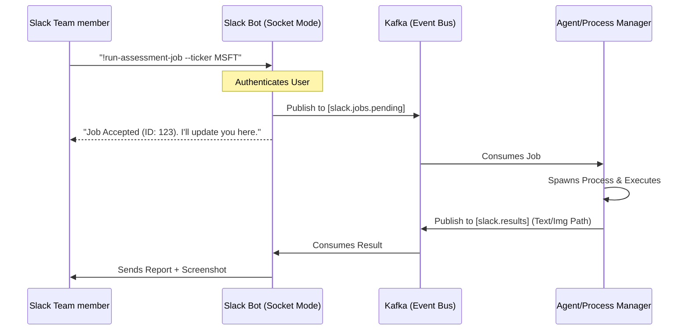

# Slack Bot Integration Roadmap: Infrastructure & Job Dispatch

## Objective
Establish a secure and resilient Slack-based command center for the **AI_Investor** system. The primary goal is to enable team members to assign jobs to agents and monitor system activity via a robust message-passing pipeline (Kafka) and a reliable "catch-up" mechanism for offline periods.

## Core Pillars
1.  **Security-First Access**: Strict identity-based command execution via `SLACK_ALLOWED_USERS`.
2.  **Job Request Pipeline**: Generic command-to-Kafka mapping to trigger agent processes.
3.  **Rich Message Passing**: Support for text, Block Kit UI, and media (screenshots/reports).
4.  **Resilient Persistence**: Catch-up logic using Slack's History API to process missed messages upon reconnection.

---

## Implementation Phases

### Phase 1: Security & Identity Layer
*Goal: Ensure only authorized team members can trigger system actions.*
-   [ ] **Admin Allowlist**: Implement `SLACK_ALLOWED_USERS` environment variable check in the middleware.
-   [ ] **Audit Logging**: Every command received (even if unauthorized) must be logged with the User ID and Timestamp.
-   [ ] **Secure Token Management**: transition from local `.env` to a more structured secret loading if needed for production.

### Phase 2: Generic Job Dispatcher (Kafka-Based)
*Goal: Decouple Slack from specific business logic using the system's event bus.*
-   [ ] **Command Parser**: Implement a regex-based or NLP-lite parser to convert Slack messages into Job Objects.
-   [ ] **Kafka Integration**:
    -   **Producer**: Publish job requests to a dedicated `slack.jobs.pending` topic.
    -   **Consumer**: Listen to a `slack.results` topic to post updates/reports back to the channel.
-   [ ] **Process Spawner**: Define a standardized integration point where a Kafka message can trigger a new agent process or system task.

### Phase 3: Reliability & Catch-up Protocol
*Goal: Zero-loss command processing.*
-   [ ] **State Tracking**: Save the `last_processed_ts` to a local persistent file (`.slack_bot_state`).
-   [ ] **Reconnection Sync**:
    -   On startup, fetch missed messages using `conversations.history` with `oldest=last_processed_ts`.
    -   Sequential processing of missed commands to maintain order.
-   [ ] **Health Monitoring**: Post a "Service Reconnected" status message summarizing any missed jobs handled.

### Phase 4: Multimedia & Reporting Engine
*Goal: support visual feedback and document delivery.*
-   [ ] **V2 Upload Integration**: Implement `files_upload_v2` for sending screenshots or PDF reports.
-   [ ] **Block Kit Templates**: Standardize "Job Result" blocks for consistent UI (Status, Execution Time, Output Links).

---

## Technical Architecture Proposal

### Message Flow Diagram

### Next Steps (Immediate)
1.  **Environment Audit**: Ensure `SLACK_BOT_TOKEN`, `SLACK_SOCKET_TOKEN`, and Kafka bootstrap servers are configured.
2.  **Modularization**: Move logic from `slack_service.py` into a new `services/notifications/slack_bot/` package.
3.  **Verification**: Implement a simple "ping-kafka" command to verify the loop.
