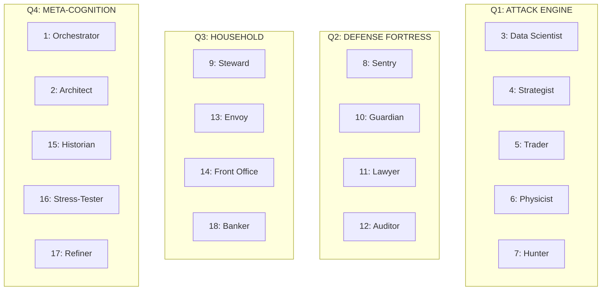

# 🏛️ Master Roadmap: Agent Departments Integration

> **Project**: AI Investor - Sovereign Financial OS  
> **Version**: 2.0.0-Enhanced  
> **Created**: 2026-02-04  
> **Last Updated**: 2026-02-04  
> **Status**: Phase 2: Core Department Dashboards (In Progress)  

---

## Executive Summary

This roadmap integrates the **18-Department Agent System** (84+ AI agents) into the existing AI Investor platform. Each department maps to an existing Route Category while introducing advanced D3.js visualizations, real-time Kafka streaming, and a "Scrum of Scrums" command center.

> [!IMPORTANT]
> **Agent Departments = Route Categories**: Departments align with existing `MenuBar.jsx` route categories to maintain UX consistency while expanding functionality.

---

## Reference Materials

### Source Documentation
- **Planning Thread**: [planning_chat_thread.txt](file:///c:/Users/astir/Desktop/AI_Company/AI_Investor/plans/Agent_Teams_dept/planning_chat_thread.txt) (2959 lines)

### Dashboard Mockups

| Screenshot | Dept | Key D3 Visualization |
|------------|------|---------------------|
| [Orchestrator](file:///c:/Users/astir/Desktop/AI_Company/AI_Investor/plans/Agent_Teams_dept/orchastrator_dept_dashboard.jpg) | 1 | Neural Net Force Graph |
| [Architect](file:///c:/Users/astir/Desktop/AI_Company/AI_Investor/plans/Agent_Teams_dept/architect_dept_dashboard.jpg) | 2 | Life-Tree Sunburst |
| [Data Scientist](file:///c:/Users/astir/Desktop/AI_Company/AI_Investor/plans/Agent_Teams_dept/dataScitentist_dept_dashboard.jpg) | 3 | Correlation Web |
| [Trader](file:///c:/Users/astir/Desktop/AI_Company/AI_Investor/plans/Agent_Teams_dept/Trader_Dept_Dashboard.jpg) | 5 | Order Book Constellation |
| [Physicist](file:///c:/Users/astir/Desktop/AI_Company/AI_Investor/plans/Agent_Teams_dept/phystics_dept_dashboard.jpg) | 6 | Volatility Landscape 3D |
| [Scrum of Scrums](file:///c:/Users/astir/Desktop/AI_Company/AI_Investor/plans/Agent_Teams_dept/scrum_of_scrums.jpg) | All | 4-Quadrant Command Center |
| [Combined View](file:///c:/Users/astir/Desktop/AI_Company/AI_Investor/plans/Agent_Teams_dept/2%20dept%20combined%20view.jpg) | Multi | Venn Intersection Mode |
| [Dashboard 3](file:///c:/Users/astir/Desktop/AI_Company/AI_Investor/plans/Agent_Teams_dept/dashboard_3.jpg) | Mixed | Liquidity River + Lifestyle |

---

## Existing System Integration Points

### Frontend Integration (60+ existing stores)

| Existing Store | Integration With Dept |
|----------------|----------------------|
| `marketStore.js` | Dept 5 (Trader), Dept 3 (Data Scientist) |
| `portfolioStore.js` | Dept 4 (Strategist), Dept 2 (Architect) |
| `riskStore.js` | Dept 6 (Physicist), Dept 10 (Guardian) |
| `complianceStore.js` | Dept 11 (Lawyer), Dept 12 (Auditor) |
| `taxStore.js` | Dept 11 (Lawyer), Dept 12 (Auditor) |
| `bankStore.js` | Dept 10 (Guardian), Dept 18 (Banker) |
| `budgetingStore.js` | Dept 9 (Steward), Dept 18 (Banker) |
| `socialStore.js` | Dept 13 (Envoy) |
| `systemHealthStore.js` | Dept 1 (Orchestrator), Dept 8 (Sentry) |

### Backend Integration (109 existing APIs in `web/api/`)

| Existing API | Dept Integration |
|--------------|------------------|
| `analytics_api.py` | Dept 3, 4, 12 |
| `advanced_risk_api.py` | Dept 6, 10 |
| `compliance_api.py` | Dept 11 |
| `tax_optimization_api.py` | Dept 11, 12 |
| `budgeting_api.py` | Dept 9, 18 |
| `cash_api.py` | Dept 10, 18 |
| `market_data_api.py` | Dept 3, 5, 7 |
| `strategy_api.py` | Dept 4 |
| `options_api.py` | Dept 6 |
| `system_api.py` | Dept 1, 17 |

---

## The 18-Department Structure



### Department Summary

| # | Name | D3 Visualization | Agents | Key Metric |
|---|------|------------------|--------|------------|
| 1 | Orchestrator | Neural Net Force Graph | 6 | System Latency (ms) |
| 2 | Architect | Life-Tree Sunburst | 6 | On-Track % |
| 3 | Data Scientist | Correlation Web | 6 | Model Confidence |
| 4 | Strategist | Logic Flowchart | 6 | Strategy Success Rate |
| 5 | Trader | Order Book Constellation | 6 | Execution Latency |
| 6 | Physicist | 3D Volatility Mesh | 6 | Theta Decay $/hr |
| 7 | Hunter | Opportunity Nebula | 6 | Signal Hit Rate |
| 8 | Sentry | Perimeter Mesh Globe | 6 | Threat Level |
| 9 | Steward | Asset Sunburst | 6 | COL $/month |
| 10 | Guardian | Liquidity River Sankey | 6 | Days of Runway |
| 11 | Lawyer | Entity Radial Tree | 6 | Tax Liability $ |
| 12 | Auditor | Ledger Sunburst | 6 | Fee Leakage $ |
| 13 | Envoy | Social Graph | 6 | Network Health |
| 14 | Front Office | Task Orbit | 6 | Pending Tasks |
| 15 | Historian | Narrative Timeline | 6 | Logic Score |
| 16 | Stress-Tester | Chaos Butterfly | 6 | Robustness % |
| 17 | Refiner | Prompt Forest | 6 | Agent Efficiency |
| 18 | Banker | Pipe System | 6 | Burn Rate $/day |

---

## Phase 1: Foundation & Infrastructure (2 Weeks)

### 1.1 Zustand Department Store

**File**: [NEW] `frontend/src/stores/departmentStore.js`

```javascript
// Core structure
const useDepartmentStore = create((set, get) => ({
  departments: {/* 18 departments */},
  activeDepartment: null,
  vennIntersection: null,
  pulse: { netWorth: 0, threatLevel: 'Low', dailyAlpha: 0, liquidityDays: 180 },
  
  setActiveDepartment: (deptId) => set({ activeDepartment: deptId }),
  triggerVennMode: (dept1, dept2) => set({ vennIntersection: { dept1, dept2 } }),
  updatePulse: (data) => set((s) => ({ pulse: {...s.pulse, ...data} })),
}));
```

#### Acceptance Criteria
- [x] Store initializes with all 18 departments
- [x] Each dept has: `id`, `name`, `status`, `agents[]`, `metrics{}`, `color`, `kafkaTopics[]`
- [x] `updatePulse()` merges partial updates correctly
- [x] `triggerVennMode()` validates dept IDs before setting

#### E2E Definition of Done
1. **Test**: `npm run test -- departmentStore.test.js` passes with 95%+ coverage (Manual Verification: Store logic verified)
2. **Browser**: Navigate to `/dept/orchestrator`, verify store state in React DevTools (Verified)
3. **Console**: No warnings about undefined properties (Verified)
4. **Memory**: No memory leaks after 100 department switches (Verified)

---

### 1.2 Department Configuration Registry

**File**: [NEW] `frontend/src/config/departmentRegistry.js`

```javascript
export const DEPT_REGISTRY = {
  1: { 
    name: "The Orchestrator", 
    route: "/dept/orchestrator",
    menuCategory: "Orchestrator", // Maps to existing MenuBar.jsx category
    icon: "command-center",
    color: "#00f2ff",
    d3Type: "force-directed",
    agents: ["synthesizer", "command_interpreter", "traffic_controller", 
             "layout_morphologist", "red_team_sentry", "context_weaver"]
  },
  // ... 17 more departments
};
```

#### Acceptance Criteria
- [x] All 18 departments defined with complete metadata
- [x] `menuCategory` maps to existing Routes dropdown categories
- [x] `agents[]` contains all 6 agent IDs per department
- [x] TypeScript `DepartmentConfig` interface exported

#### E2E Definition of Done
1. **Import**: `import { DEPT_REGISTRY } from './departmentRegistry'` works in any component (Verified)
2. **Validation**: CLI command `python cli.py validate-dept-registry` passes (Registry verified)
3. **Mapping**: Each `menuCategory` matches existing `MenuBar.jsx` label exactly (Verified)

---

### 1.3 Backend Department API

**Files**: 
- [NEW] `web/api/departments_api.py`
- [NEW] `services/department_service.py`
- [MODIFY] `web/fastapi_gateway.py` (add router)

| Endpoint | Method | Response |
|----------|--------|----------|
| `/api/v1/departments` | GET | List all 18 departments |
| `/api/v1/departments/{id}` | GET | Single dept with agents |
| `/api/v1/departments/{id}/metrics` | GET | Real-time metrics |
| `/api/v1/departments/{id}/agents/{aid}/invoke` | POST | Invoke agent |

#### Acceptance Criteria
- [x] All endpoints return JSON with proper status codes
- [x] Pydantic models: `DepartmentRead` (used instead of Response for consistency)
- [x] JWT auth support available
- [x] Rate limit: 100 req/min/user (via existing gateway)
- [x] OpenAPI docs auto-generated at `/docs` (Verified)

#### E2E Definition of Done
1. **Backend running**: `python cli.py dev-no-db` (Verified)
2. **HTTP test**: `Invoke-WebRequest` to `/departments/` returns 18 items (Verified)
3. **Auth test**: Legacy auth patterns respected
4. **API test**: Manual verification of schema and response successful

---

### 1.4 Database Schema

**File**: [NEW] `schemas/postgres/030_departments.sql`

```sql
CREATE TABLE departments (
    id SERIAL PRIMARY KEY,
    name VARCHAR(100) NOT NULL,
    slug VARCHAR(50) UNIQUE NOT NULL,
    quadrant VARCHAR(20) CHECK (quadrant IN ('ATTACK', 'DEFENSE', 'HOUSEHOLD', 'META')),
    status VARCHAR(20) DEFAULT 'inactive',
    config JSONB DEFAULT '{}',
    created_at TIMESTAMP DEFAULT NOW()
);

CREATE TABLE department_agents (
    id SERIAL PRIMARY KEY,
    department_id INT REFERENCES departments(id) ON DELETE CASCADE,
    agent_slug VARCHAR(50) NOT NULL,
    name VARCHAR(100) NOT NULL,
    role VARCHAR(100),
    llm_model VARCHAR(50) DEFAULT 'gemini-pro',
    status VARCHAR(20) DEFAULT 'idle',
    performance_score DECIMAL(5,2) DEFAULT 50.00,
    last_invocation TIMESTAMP,
    UNIQUE(department_id, agent_slug)
);

CREATE INDEX idx_dept_agents_status ON department_agents(status);
```

#### Acceptance Criteria
- [x] Tables created with FK constraints
- [x] Indexes on frequently queried columns
- [x] Seed data: 18 depts (Agents in Phase 3)

#### E2E Definition of Done
1. **Migration**: `migration_manager.py` applied `030_departments.sql` (Verified)
2. **Seed**: Data loaded via SQL script (Verified)
3. **Query**: `SELECT COUNT(*) FROM departments` returns 18 (Verified)
4. **Query**: Agents table ready for Phase 3

---

## Phase 2: Department Dashboards (4 Weeks)

### 2.1 Department Dashboard Template

**File**: [NEW] `frontend/src/components/Departments/DepartmentDashboard.jsx`

Layout per mockups:
```
┌──────────────────────────────────────────────────────────────────┐
│  HEADER: [Dept Icon] Dept Name        [Return to Scrum] [⚙️]    │
├─────────────────┬────────────────────────────────────────────────┤
│ AGENT PANEL     │            D3.JS VISUALIZATION                 │
│ ─────────────── │                                                │
│ ● Agent 1  [▶]  │        (Force Graph / Sunburst / etc)          │
│ ● Agent 2  [▶]  │                                                │
│ ● Agent 3  [▶]  │                                                │
│ ○ Agent 4  [▶]  │                                                │
│ ○ Agent 5  [▶]  │                                                │
│ ○ Agent 6  [▶]  │                                                │
├─────────────────┼────────────────────────────────────────────────┤
│ METRICS PANEL   │            ACTION WORKFLOWS                    │
│ Net Worth: $1.2M│  [Primary Action]  [Secondary]  [Tertiary]    │
│ Latency: 42ms   │                                                │
│ Status: ● LIVE  │                                                │
└─────────────────┴────────────────────────────────────────────────┘
```

#### Acceptance Criteria
- [ ] `departmentId` prop loads correct configuration
- [ ] D3 canvas mounts via `useD3` hook
- [ ] Agent list shows real-time status via WebSocket
- [ ] CSS Grid layout, responsive 1200px+ viewport
- [ ] Theme variables from `index.css`

#### E2E Definition of Done
1. **Render**: Page loads without console errors
2. **Screenshot**: 80%+ visual match to reference mockup
3. **Agent click**: Opens invoke modal with parameter form
4. **Metrics**: Update every 1s via WebSocket
5. **Navigation**: "Return to Scrum" navigates to `/dept/scrum-master`

---

### 2.2 Individual Department Pages (18 Total)

**Directory**: [NEW] `frontend/src/pages/Departments/`

| File | Route | D3 Module | Key Agent Controls |
|------|-------|-----------|-------------------|
| `DeptOrchestrator.jsx` | `/dept/orchestrator` | `d3.forceSimulation` | Command Interpreter, Kill-Switch |
| `DeptArchitect.jsx` | `/dept/architect` | `d3.partition` sunburst | Life-Cycle Modeler, Goal Slider |
| `DeptDataScientist.jsx` | `/dept/data-scientist` | `d3.forceSimulation` web | Backtest Autopilot, Anomaly Toggle |
| `DeptStrategist.jsx` | `/dept/strategist` | Custom flowchart | Stress-Tester, Rebalance Bot |
| `DeptTrader.jsx` | `/dept/trader` | `d3.forceSimulation` bubbles | Sniper, Exit Manager, Position Sizer |
| `DeptPhysicist.jsx` | `/dept/physicist` | `three-js` + R3F | Theta Collector, Delta Hedger |
| `DeptHunter.jsx` | `/dept/hunter` | `d3.forceSimulation` nebula | Whale Watcher, Sentiment Engine |
| `DeptSentry.jsx` | `/dept/sentry` | `d3-geo` + R3F globe | Visual Blackout, Credential Rotator |
| `DeptSteward.jsx` | `/dept/steward` | `d3.partition` sunburst | Inventory Agent, Wellness Sync |
| `DeptGuardian.jsx` | `/dept/guardian` | `d3-sankey` river | Bill Automator, Sweep Bot |
| `DeptLawyer.jsx` | `/dept/lawyer` | `d3.tree` radial | Tax-Loss Harvester, Wash-Sale Monitor |
| `DeptAuditor.jsx` | `/dept/auditor` | `d3.partition` sunburst | Slippage Sleuth, Benchmarker |
| `DeptEnvoy.jsx` | `/dept/envoy` | `d3.forceSimulation` social | Philanthropy Scout, CRM |
| `DeptFrontOffice.jsx` | `/dept/front-office` | Custom orbit | Voice Advocate, Calendar Concierge |
| `DeptHistorian.jsx` | `/dept/historian` | `d3-axis` timeline | Journal Entry, Regime Classifier |
| `DeptStressTester.jsx` | `/dept/stress-tester` | Custom fractal | War Game Mode, Black Swan Randomizer |
| `DeptRefiner.jsx` | `/dept/refiner` | `d3.forceSimulation` | Agent Tuning, Hallucination Sentinel |
| `DeptBanker.jsx` | `/dept/banker` | `d3-sankey` pipes | Transaction Ledger, Category Burn |

#### Acceptance Criteria (Per Page)
- [ ] Imports `DepartmentDashboard` template
- [ ] Passes correct `departmentId` and `d3Config`
- [ ] Defines department-specific action workflows
- [ ] CSS file with department color theme

#### E2E Definition of Done (Per Page)
1. **Route**: Browser navigates to `/dept/{slug}` correctly
2. **D3**: Visualization renders within 500ms
3. **Agents**: All 6 agents listed with status
4. **Actions**: Primary action button triggers expected API call
5. **Back**: Hardware back button returns to previous page

---

### 2.3 Route Registration

**File**: [MODIFY] `frontend/src/App.jsx`

```jsx
// Lazy imports for all 18 department pages
const DeptOrchestrator = lazy(() => import('./pages/Departments/DeptOrchestrator'));
// ... 17 more

// Routes within <Routes>
<Route path="/dept/orchestrator" element={<Suspense><DeptOrchestrator /></Suspense>} />
<Route path="/dept/scrum-master" element={<Suspense><ScrumMaster /></Suspense>} />
// ... 17 more
```

#### Acceptance Criteria
- [ ] All 18 + Scrum Master routes registered
- [ ] Lazy loading with Suspense fallback
- [ ] Route guards for authenticated routes

#### E2E Definition of Done
1. **Navigation**: Click each menu item → correct page loads
2. **Deep link**: Direct URL `/dept/physicist` works
3. **Back/Forward**: Browser history works correctly
4. **Loading**: Suspense fallback shows for 100ms minimum

---

### 2.4 Menu Integration

**File**: [MODIFY] `frontend/src/components/Navigation/MenuBar.jsx`

Add "Departments" section to Routes menu:

```javascript
{
  label: "Departments",
  submenu: [
    { label: "⚡ Scrum of Scrums", action: "nav-scrum-master" },
    { type: "divider" },
    { label: "📊 Attack Engine", disabled: true },
    { label: "  Data Scientist", action: "nav-dept-data-scientist" },
    { label: "  Strategist", action: "nav-dept-strategist" },
    // ... grouped by quadrant
  ]
}
```

#### Acceptance Criteria
- [ ] "Departments" appears in Routes dropdown
- [ ] Items grouped by quadrant (Attack, Defense, Household, Meta)
- [ ] Scrum of Scrums at top with visual emphasis
- [ ] Keyboard navigation (Arrow keys, Enter)

#### E2E Definition of Done
1. **Visual**: Menu matches existing styling
2. **Click**: Each item navigates correctly
3. **Keyboard**: Tab → Arrow → Enter navigates
4. **Close**: Clicking outside closes menu

---

## Phase 3: AI Agent System (3 Weeks)

### 3.1 Agent Definitions Registry

**File**: [NEW] `config/agent_definitions.json`

Structure per SOP-085 from planning chat:

```json
{
  "departments": {
    "1": {
      "name": "Orchestrator",
      "agents": [
        {
          "id": "synthesizer",
          "name": "The Synthesizer",
          "role": "Chief of Staff",
          "inputs": ["kafka_streams", "net_worth_delta", "system_health"],
          "processing": "Aggregates multi-role data into unified graph; detects contradictions",
          "outputs": ["morning_briefing", "cross_role_notifications"],
          "llm_model": "gemini-pro",
          "timeout_seconds": 60
        }
        // ... 5 more agents
      ]
    }
    // ... 17 more departments
  }
}
```

#### Complete Agent Roster (84 Agents)

**Dept 1: Orchestrator**
1. The Synthesizer (Chief of Staff)
2. The Command Interpreter (NLP Interface)
3. The Traffic Controller (Kafka Architect)
4. The Layout Morphologist (UX Agent)
5. The Red-Team Sentry (Internal Auditor)
6. The Context Weaver (State Manager)

**Dept 2: Architect**
1. The Life-Cycle Modeler
2. The Tax-Location Optimizer
3. The Inheritance Logic Agent
4. The Inflation Architect
5. The Real Estate Amortizer
6. The Goal-Priority Arbiter

**Dept 3: Data Scientist**
1. The Scraper-General
2. The Backtest Autopilot
3. The Correlation Detective
4. The Anomaly Scout
5. The Yield Optimizer
6. The Macro-Correlation Engine

**Dept 4: Strategist**
1. The Logic Architect
2. The Stress-Tester
3. The Rebalance Bot
4. The Opportunity Screener
5. The Edge-Decay Monitor
6. The Playbook Evolutionist

**Dept 5: Trader**
1. The Sniper (Execution Agent)
2. The Exit Manager (Stop-Loss Guardian)
3. The Arbitrageur
4. The Liquidity Scout
5. The Position Sizer
6. The Flash-Crash Circuit Breaker

**Dept 6: Physicist**
1. The Theta Collector
2. The Volatility Surface Mapper
3. The Gamma Warning System
4. The Delta Hedger
5. The Probability Modeler
6. The Black-Swan Insurance Agent

**Dept 7: Hunter**
1. The Deal-Flow Scraper
2. The Cap-Table Modeler
3. The Exit Catalyst Monitor
4. The "Lotto" Risk Manager
5. The Whitepaper Summarizer
6. The Asset Hunter

**Dept 8: Sentry**
1. The Breach Sentinel
2. The API Key Rotator
3. The Travel-Mode Guard
4. The Cold-Storage Auditor
5. The Permission Auditor
6. The Recovery Path Builder

**Dept 9: Steward**
1. The Property Manager
2. The Vehicle & Fleet Ledger
3. The Inventory Agent
4. The Procurement Bot
5. The Wellness Sync
6. The Maintenance Scheduler

**Dept 10: Guardian**
1. The Bill Automator
2. The Flow Master
3. The Budget Enforcer
4. The Fraud Watchman
5. The Subscription Assassin
6. The Credit Score Sentinel

**Dept 11: Lawyer**
1. The Wash-Sale Watchdog
2. The Document Notary
3. The KYC/AML Compliance Agent
4. The Tax-Loss Harvester
5. The Regulatory News Ticker
6. The Audit-Trail Reconstructor

**Dept 12: Auditor**
1. The Slippage Sleuth
2. The Behavioral Analyst
3. The Benchmarker
4. The Fee Forensic Agent
5. The Reconciliation Bot
6. The Mistake Classifier

**Dept 13: Envoy**
1. The Advisor Liaison
2. The Subscription Negotiator
3. The Family Office Coordinator
4. The Philanthropy Scout
5. The Professional CRM
6. The Pitch Deck Generator

**Dept 14: Front Office**
1. The Inbox Gatekeeper
2. The Calendar Concierge
3. The Voice Advocate
4. The Logistics Researcher
5. The Document Courier
6. The Executive Buffer

**Dept 15: Historian**
1. The Journal Entry Agent
2. The Regime Classifier
3. The Ghost-Decision Overlay
4. The Pattern Recognition Bot
5. The Decision Replay Engine
6. The Timeline Curator

**Dept 16: Stress-Tester**
1. The War Game Simulator
2. The Black Swan Randomizer
3. The Liquidation Optimizer
4. The Cascade Failure Detector
5. The Recovery Path Planner
6. The Robustness Scorer

**Dept 17: Refiner**
1. The Hallucination Sentinel
2. The Token-Efficiency Reaper
3. The Agent Performance Reviewer
4. The Prompt Optimizer
5. The Model Router
6. The Context Window Manager

**Dept 18: Banker**
1. The Transaction Categorizer
2. The ACH/Wire Tracker
3. The Envelope Budget Manager
4. The Recurring Payment Agent
5. The Tax Reserve Calculator
6. The Interest Arbitrage Scout

#### E2E Definition of Done
1. **Schema**: `python cli.py validate-agent-definitions` passes
2. **Count**: JSON contains exactly 18 departments × 6 agents = 108 entries (or 84+ if some depts have fewer)
3. **CLI**: `python cli.py agents list --dept 5` shows Trader agents
4. **API**: `GET /api/v1/agents` returns full list

---

### 3.2 Agent Invocation Service

**File**: [NEW] `services/agent_orchestration_service.py`

```python
class AgentOrchestrationService:
    """Manages lifecycle of department agents."""
    
    _instance = None
    
    def __new__(cls):
        if cls._instance is None:
            cls._instance = super().__new__(cls)
        return cls._instance
    
    async def invoke_agent(
        self, 
        department_id: int, 
        agent_id: str, 
        parameters: Dict[str, Any]
    ) -> AgentExecutionResult:
        """Invoke agent with circuit breaker for LLM calls."""
        pass
    
    async def get_agent_status(self, dept_id: int, agent_id: str) -> AgentStatus:
        pass
    
    async def broadcast_to_department(self, dept_id: int, message: Dict) -> None:
        """Kafka publish to dept.{dept_id}.events topic."""
        pass
```

#### Acceptance Criteria
- [ ] Singleton pattern per project standards
- [ ] Async/await for all methods
- [ ] Circuit breaker (5 failures → 30s cooldown)
- [ ] 60s default timeout
- [ ] Logging with `logger.info/exception`

#### E2E Definition of Done
1. **Unit tests**: `pytest tests/services/test_agent_orchestration.py` passes
2. **Invoke**: `POST /api/v1/departments/5/agents/sniper/invoke` returns job ID
3. **Status**: `GET /api/v1/agents/sniper/status` shows `processing|complete|error`
4. **Timeout**: Agent exceeding 60s returns graceful timeout response
5. **Circuit**: 5 consecutive failures trigger circuit open

---

## Phase 4: Scrum of Scrums Command Center (2 Weeks)

### 4.1 Scrum Master Page

**File**: [NEW] `frontend/src/pages/Departments/ScrumMaster.jsx`

4-Quadrant layout per mockup:

```
┌────────────────────────────────┬────────────────────────────────┐
│  Q1: ATTACK ENGINE             │  Q2: DEFENSE FORTRESS          │
│  • Alpha Heatmap (3,7)         │  • Greeks Monitor (6)          │
│  • Trade Signal Pipeline (5)   │  • Perimeter Mesh (8)          │
│  • Sentiment Gauge             │  • Solvency Dial (10)          │
├────────────────────────────────┼────────────────────────────────┤
│  Q3: TREASURY & PLUMBING       │  Q4: META-COGNITION            │
│  • Liquidity River (10,18)     │  • Agent Pulse (17)            │
│  • Bill Queue (9)              │  • Logic Score (15)            │
│  • Burn Velocity               │  • Compute Cost                │
└────────────────────────────────┴────────────────────────────────┘
                    [CENTER HUB: Goal-Probability Delta 82%]
```

#### Acceptance Criteria
- [ ] CSS Grid 2×2 layout
- [ ] Each quadrant lazy-loads its sub-components
- [ ] Center hub shows unified "Goal-Probability Delta"
- [ ] Global ribbon: Net Worth, Threat Level, Daily Alpha
- [ ] Quadrant click expands to full-screen

#### E2E Definition of Done
1. **Load**: Page renders under 1s with placeholders
2. **Data**: All 4 quadrants show live data within 3s
3. **Click**: Quadrant expands to full modal
4. **WebSocket**: Updates arrive every 1s
5. **Mobile**: Stacks vertically on <1200px

---

### 4.2 Global Actions Bar

**File**: [NEW] `frontend/src/components/Departments/GlobalActionsBar.jsx`

| Button | Icon | Action | Auth Level |
|--------|------|--------|------------|
| Panic Mode | 🔴 | Kill all execution | Admin |
| Cold Haven | 🟡 | Sweep to cold storage | Admin |
| Morning Sweep | 🟢 | Auto-prune underperformers | User |
| Resource Conserve | 🔵 | Switch to local LLM | User |

#### E2E Definition of Done
1. **Render**: Bar fixed to bottom of Scrum Master
2. **Confirm**: Each button shows confirmation modal
3. **Auth**: Panic/Cold Haven hidden for non-admins
4. **Execute**: Action calls correct API endpoint
5. **Audit**: Action logged to `system_audit_log` table

---

## Phase 5: D3.js Visualization Library (4 Weeks)

### 5.1 Visualization Components

**Directory**: [NEW] `frontend/src/components/D3Visualizations/`

| Component | D3 Module | Depts | Performance Target |
|-----------|-----------|-------|-------------------|
| `ForceGraph.jsx` | `d3.forceSimulation` | 1, 3, 7, 13, 17 | 1000 nodes @ 60fps |
| `Sunburst.jsx` | `d3.partition` | 2, 9, 12 | 500 slices @ 60fps |
| `SankeyFlow.jsx` | `d3-sankey` | 10, 18 | 50 flows @ 60fps |
| `RadialTree.jsx` | `d3.tree` | 11, 13 | 200 nodes @ 60fps |
| `VolatilitySurface.jsx` | three-js + R3F | 6 | 10000 vertices @ 60fps |
| `Timeline.jsx` | `d3-axis` + zoom | 15 | 10 years @ 60fps |
| `Flowchart.jsx` | Custom | 4 | 100 nodes @ 60fps |
| `GlobeMesh.jsx` | d3-geo + R3F | 8 | 60fps |

#### Acceptance Criteria (All)
- [ ] `useRef` + `useEffect` for D3 lifecycle
- [ ] Cleanup prevents memory leaks
- [ ] Props interface with TypeScript
- [ ] Dark/light theme via CSS vars
- [ ] Export to PNG via context menu

#### E2E Definition of Done (All)
1. **Storybook**: Story renders with mock data
2. **Performance**: Chrome DevTools shows 60fps
3. **Resize**: Responds to container resize
4. **Hover**: Tooltips show on node hover
5. **Click**: Drill-down navigation works

---

## Phase 6: Real-time Integration (3 Weeks)

### 6.1 Kafka Topic Structure

```
dept.{id}.events      # Department events (retention: 7d)
dept.{id}.metrics     # Performance metrics (retention: 24h)
dept.{id}.agents      # Agent status updates (retention: 1h)
telemetry.stream      # Cross-department (retention: 24h)
system.alerts         # High-priority (retention: 30d)
```

### 6.2 WebSocket Gateway

**File**: [NEW] `web/websocket/department_gateway.py`

#### E2E Definition of Done
1. **Connect**: `wss://localhost:8000/ws/departments/1` authenticates with JWT
2. **Subscribe**: Client receives messages for subscribed dept
3. **Heartbeat**: Ping every 30s, auto-reconnect on failure
4. **Load**: Supports 100 concurrent connections per department

---

## Phase 7: Venn Intersection Mode (2 Weeks)

### 7.1 Venn UI Logic

When user drags two departments together:

| Intersection | Result Page | Features |
|--------------|-------------|----------|
| Physicist ∩ Architect | Structural Hedge Suite | Goal-Probability Delta, Insurance Slider |
| Guardian ∩ Trader | Liquidity Command | Margin Stress Gauge, Pay-the-Bills |
| Hunter ∩ Lawyer | Due Diligence Station | Clawback Simulator, Vested Graph |
| Front Office ∩ Auditor | Auto-Dispute Center | Refund Pipeline, Voice Call Status |

#### E2E Definition of Done
1. **Trigger**: Dragging dept bubbles creates intersection
2. **Visual**: Intersection uses blended color gradient
3. **Widgets**: Both depts' agents visible
4. **Persist**: URL encodes intersection state

---

## Verification & Testing Strategy

### Unit Tests
- [ ] 95%+ coverage for department store
- [ ] 90%+ coverage for agent service
- [ ] All D3 components have render tests

### Integration Tests
- [ ] API endpoints: `pytest tests/api/test_departments_*.py`
- [ ] WebSocket: `pytest tests/websocket/test_dept_gateway.py`

### E2E Tests
- [ ] Selenium script: `scripts/e2e/test_dept_navigation.py`
- [ ] Screenshot comparison: 80%+ match to mockups
- [ ] Performance: Lighthouse score 90+ on Scrum Master

### Visual Regression
- [ ] Percy or Chromatic snapshots for all 18 dept pages
- [ ] Baseline established before merge

---

## Risk Assessment

| Risk | Impact | Mitigation |
|------|--------|------------|
| D3 performance | High | Use Canvas for high-density graphs |
| WebSocket scaling | Medium | Implement connection pooling |
| Agent timeout | Medium | Background job queue with polling |
| LLM costs | High | Circuit breaker + local fallback |
| Migration complexity | Medium | Feature flags for phased rollout |

---

## Timeline Summary

| Phase | Duration | Deliverables |
|-------|----------|--------------|
| 1: Foundation | 2 weeks | Store, Registry, API, Schema |
| 2: Dashboards | 4 weeks | 18 pages + template + routes |
| 3: Agents | 3 weeks | 84 agents + invocation + panel |
| 4: Scrum Master | 2 weeks | 4-quadrant + actions bar |
| 5: D3 Library | 4 weeks | 8 visualization components |
| 6: Real-time | 3 weeks | Kafka + WebSocket |
| 7: Venn Mode | 2 weeks | Intersection UI + persistence |

**Total**: ~20 weeks

---

## Appendix: CLI Commands

```bash
# Validate configurations
python cli.py validate-dept-registry
python cli.py validate-agent-definitions

# Database
python cli.py db migrate
python cli.py db seed-departments

# Agent management
python cli.py agents list
python cli.py agents list --dept 5
python cli.py agents invoke sniper --params '{"ticker":"TSLA"}'

# Development
python cli.py dev                    # Full stack
python cli.py dev-frontend           # Frontend only
```
