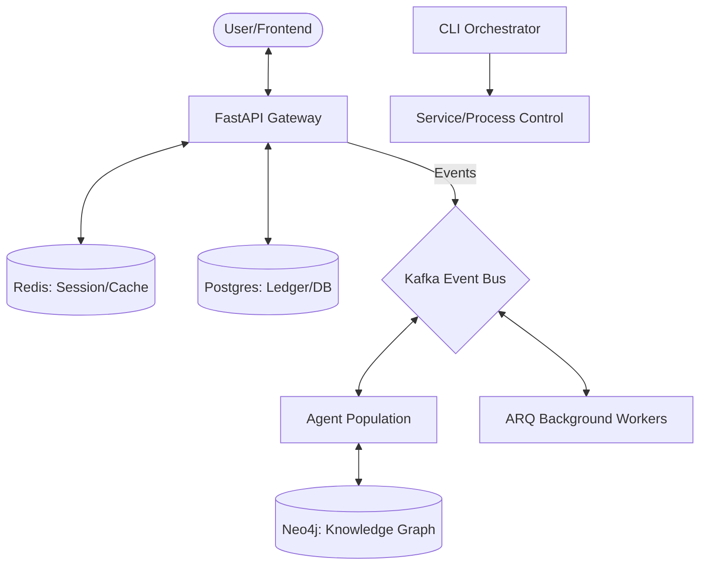

# Backend Runtime Overview

The Sovereign OS backend is a high-performance, asynchronous ecosystem designed for 100% autonomous financial operations. It is built using a "Service-Oriented Architecture" (SOA) with a centralized command orchestrator and an event-driven core.

## Runtime Architecture

The system operates across three primary layers:

1.  **The Orchestration Layer (`cli.py`)**: The entry point for all system controls, deployments, and developer workflows.
2.  **The Communication Layer (`FastAPI` & `Kafka`)**: Manages real-time requests from the frontend and asynchronous events between agents.
3.  **The Execution Layer (`Agents` & `Workers`)**: Where the actual financial logic, research, and trading occur.

## Key Technology Stack

-   **Language**: Python 3.12+ (PEP 8, Strictly Typed)
-   **Framework**: FastAPI (High-concurrency API Gateway)
-   **Process Management**: Unified CLI registry with Subprocess/Docker control.
-   **Async Engine**: `asyncio` for non-blocking I/O.
-   **Task Queue**: ARQ (Redis-based) for high-reliability background jobs.
-   **Event Bus**: Kafka for inter-agent communication and telemetry.
-   **Infrastructure**: Dockerized services (Postgres, Neo4j, Redis, Kafka).

## Security & Binding
By default, all backend services bind to **`127.0.0.1`** (loopback) to ensure Zero-Trust isolation. Access for LAN distribution is managed through explicit certificate-based configuration and firewall rules.
