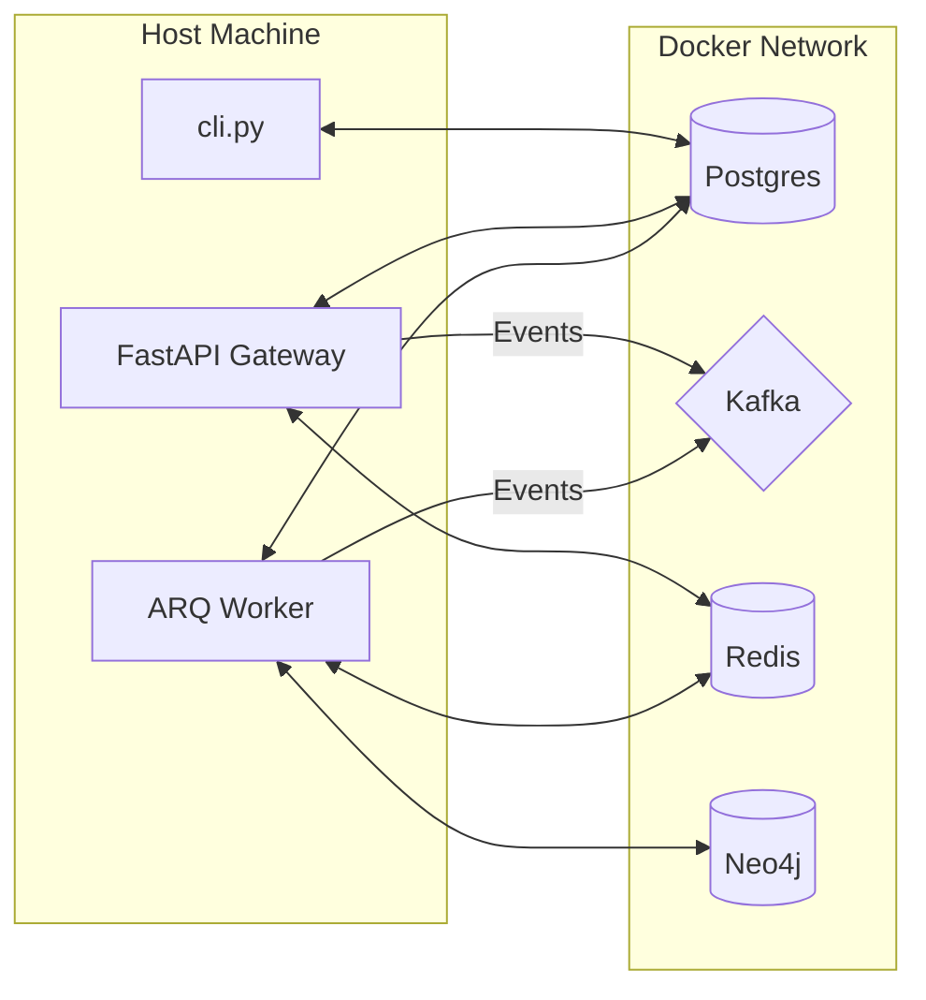

# Docker Infrastructure Overview

The AI Investor leverages Docker to containerize its entire "Data Layer" and infrastructure dependencies. This ensures that the system is isolated, reproducible, and easy to deploy across different environments—from a local developer laptop to a distributed cluster of Linux boxes.

## Role of Docker in Sovereign OS

Docker is responsible for hosting the stateful components of the system:
1.  **Transactional Ledger (Postgres)**: Stores trade history, user data, and system state.
2.  **Event Stream (Kafka/Zookeeper)**: The central nervous system for inter-agent communication.
3.  **Knowledge Graph (Neo4j)**: Stores complex relationships between assets, market catalysts, and agent experiences.
4.  **In-Memory Cache (Redis)**: High-speed session management and worker job queue.

## Container Architecture

All containers are connected via a dedicated bridge network: `investor-network`. This allows services to communicate using internal DNS names (e.g., `postgres:5432`) without exposing ports to the host unless explicitly mapped.

## Zero-Trust Isolation

As a core security principle, all containers bind their exposed ports to **`127.0.0.1`** by default. This prevents the database and event streams from being accessible over the local network unless the user explicitly reconfigures the bind IP for LAN distribution.

## Storage Persistence

Container data is persisted to the host filesystem in the `data/` directory:
- `data/postgres/` -> `/var/lib/postgresql/data`
- `data/neo4j/` -> `/data`

This ensures that database state survives container restarts and upgrades.
