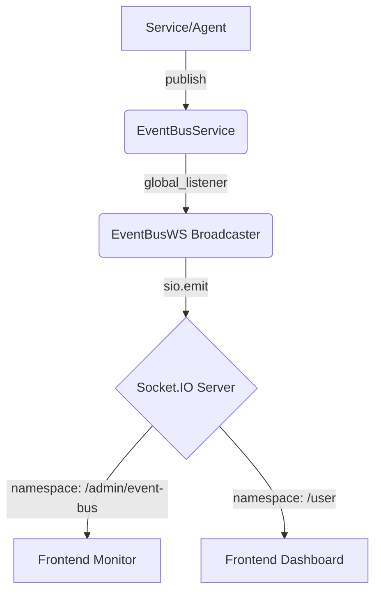

# Messaging & WebSocket Architecture

This document describes the flow of events from the backend `EventBusService` to the frontend client via WebSockets.

## End-to-End Flow

## Core Components

### 1. EventBusService (Singleton)
Path: `services/infrastructure/event_bus.py`
- The central nervous system of the application.
- Handles in-memory publication/subscription.
- Maintains a short-term history of events for replay.
- **Key Methods**:
    - `publish(topic, payload)`: Broadcasts to all listeners.
    - `add_global_listener(handler)`: Used by broadcasters to intercept all traffic.

### 2. Socket Broadcaster
Path: `web/ws_legacy/event_bus_ws.py`
- Subscribes to the `EventBusService` as a global listener.
- Maps internal topics to Socket.IO namespaces/events.
- Handles thread-safety using `asyncio.get_running_loop()`.

### 3. Socket.IO Gateway
Path: `web/socket_gateway.py`
- Orchestrates the `AsyncServer` and various namespaces.
- Mounted in `web/fastapi_gateway.py`.

### 4. Frontend Client
Path: `frontend/src/services/presenceService.js` & `EventBusMonitor.jsx`
- Uses `socket.io-client` to connect.
- Uses Vite's proxy (port 5173 -> 5050) to reach the backend.

## Design Decisions

- **Namespacing**: We use specific namespaces (e.g., `/admin/event-bus`) to isolate sensitive data from general user traffic.
- **Stability**: Kafka Admin timeouts are kept low (2s) to prevent the event loop from hanging in local development.
- **Replay**: The `test_event_bus.py` script uses the `/replay` REST endpoint to inject events manually for testing.
